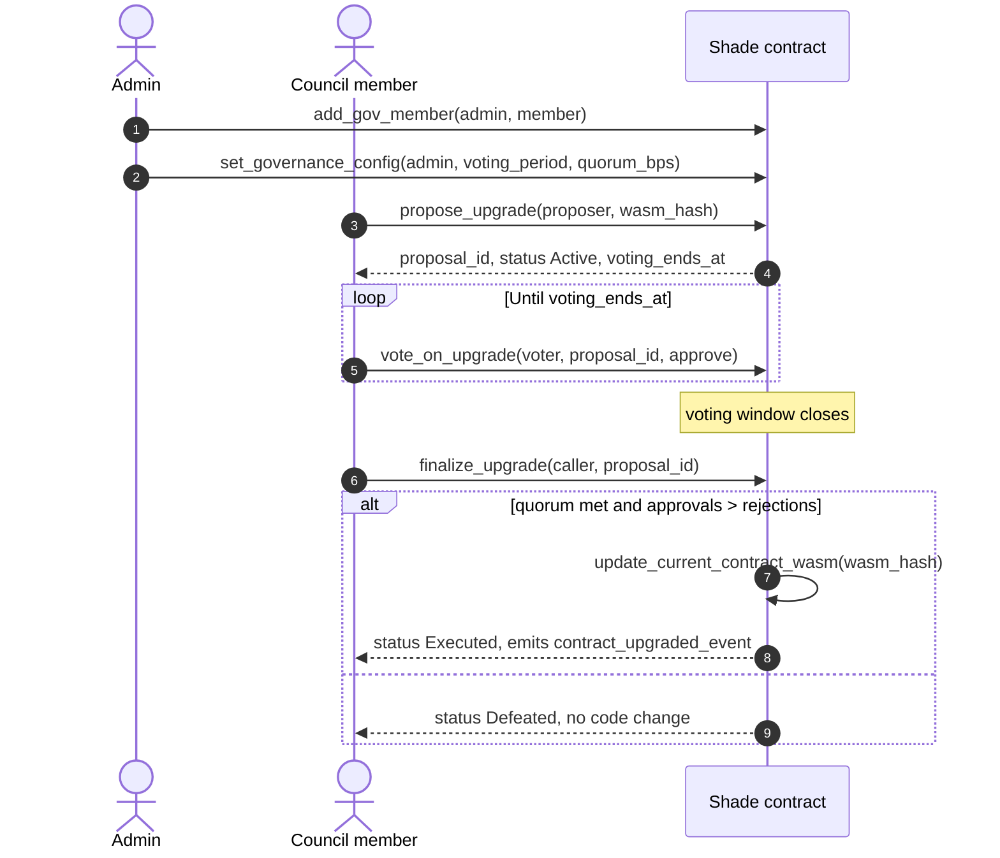

# Upgradeability, WASM hash management, and versioning

How the Shade hub contract's code is replaced, who may replace it, what survives the swap, and the storage compatibility rules you must respect when you change a persisted type. Read this before changing anything in [`contracts/shade/src/types.rs`](../../contracts/shade/src/types.rs).

The page also covers the separate question of the merchant [account](../glossary.md#merchant-account) contract's WASM hash, which is managed by the hub but is *not* an upgrade of the hub.

## What is upgradeable and what is not

Only the `shade` hub contract can replace its own code. `update_current_contract_wasm` — the Soroban host function that performs an upgrade — appears in exactly two places in this workspace, both in `shade`:

| Location | Path |
|---|---|
| Admin emergency upgrade | [`contracts/shade/src/components/upgrade.rs#L9-L10`](../../contracts/shade/src/components/upgrade.rs#L9-L10) |
| Governance-approved upgrade | [`contracts/shade/src/components/governance.rs#L261-L262`](../../contracts/shade/src/components/governance.rs#L261-L262) |

Every other contract in the repository — `account`, `escrow`, `ticketing`, `subscription`, `crowdfund`, and the three factories — is **immutable once deployed**. None of them exposes an upgrade entry point. A factory can change which WASM its *future* deployments use, which is a different thing entirely; see [Hub upgrades versus factory-deployed WASM](#hub-upgrades-versus-factory-deployed-wasm).

## The upgrade mechanism

### The admin path

```rust
// contracts/shade/src/components/upgrade.rs
pub fn upgrade(env: &Env, new_wasm_hash: &BytesN<32>) {
    let admin = core::get_admin(env);
    core::assert_admin(env, &admin);

    env.deployer()
        .update_current_contract_wasm(new_wasm_hash.clone());

    events::publish_contract_upgraded_event(env, new_wasm_hash.clone(), env.ledger().timestamp());
}
```

The authorization is exactly `core::assert_admin`:

```rust
// contracts/shade/src/components/core.rs#L12-L17
pub fn assert_admin(env: &Env, admin: &Address) {
    admin.require_auth();
    if *admin != get_admin(env) {
        panic_with_error!(env, ContractError::NotAuthorized);
    }
}
```

Note the shape of the caller-side check: `upgrade` does not take an `admin` argument. It *reads* the admin from `DataKey::Admin` and then requires that address's authorization. There is no way to pass a different address in, so the only signature that satisfies the call is the current admin's. A non-admin invocation fails at `require_auth`, not at the equality check.

Three further properties of this path, all deliberate:

- **It is not pausable.** [`contracts/shade/src/shade.rs`](../../contracts/shade/src/shade.rs) calls `upgrade_component::upgrade` with no `pausable_component::assert_not_paused` in front of it, unlike almost every other state-changing entry point. That is what lets an operator pause the contract, ship a fix, and unpause — an upgrade blocked by the pause it is meant to remedy would be useless.
- **It is not reentrancy-guarded.** `set_account_wasm_hash` wraps itself in `reentrancy::enter`/`exit`; `upgrade` does not. It makes no external calls, so there is nothing to re-enter.
- **It takes effect for the next invocation, not the current one.** The rest of the transaction runs on the old code.

### The governance path

The admin path is the emergency lever. The routine path is the DAO flow in [`contracts/shade/src/components/governance.rs`](../../contracts/shade/src/components/governance.rs), which reaches the same host function through a council vote:



The rules `finalize_upgrade` enforces: the caller must be a council member; the proposal must still be `Active`; the voting window must have closed; the required approvals are `ceil(member_count × quorum_bps / 10_000)`, floored at 1 so an empty council can never auto-pass; and the total votes cast must meet that quorum *and* approvals must exceed rejections. Either outcome closes the proposal exactly once, so `finalize_upgrade` cannot be replayed.

> **Warning:** The two paths are independent. Nothing prevents the admin from calling `upgrade` directly while a proposal is open, and doing so does not close that proposal. Reserve the direct call for incidents, and record the reason.

### How storage survives

A Soroban contract's deployed identity has two separable parts:

| Part | Where it lives | What an upgrade does to it |
|---|---|---|
| Contract instance (its executable — the WASM hash it runs) | The instance ledger entry for the contract address | **Replaced** with `new_wasm_hash` |
| Contract data (every persistent, instance, and temporary entry) | Separate ledger entries keyed by contract address + storage key | **Untouched** |

`update_current_contract_wasm` rewrites only the executable reference. The contract keeps its address, and every ledger entry written under that address stays exactly as it was, byte for byte. The upgraded code then reads those same entries.

That is what makes storage compatibility your responsibility rather than the platform's: the host does not know or care whether the new code interprets the old bytes correctly. It will hand them over either way. [`test_state_persists_after_upgrade`](../../contracts/shade/src/tests/test_upgrade.rs) asserts this end to end — it writes `DataKey::Admin` and `DataKey::AcceptedTokens`, upgrades to a different WASM, and reads both back through `env.as_contract`.

## Storage compatibility rules

These are not style preferences. Breaking one of them means the upgraded contract reads a stored value, fails to convert it, and traps — for every merchant, invoice, or campaign written before the upgrade, permanently, with no way back except another upgrade that restores the old shape.

To reason about them you need to know how the SDK encodes each kind of type on the ledger.

### Key enums: the variant *name* is the identity

`DataKey`, `EventKey`, `CampaignKey`, `GovKey`, and the rest of the per-domain key enums are `#[contracttype]` enums with unit and tuple variants. Each encodes to a vector whose first element is the **variant name as a symbol**, followed by its tuple arguments. On read, the SDK resolves that symbol against the list of variant names.

| Do | Don't |
|---|---|
| Add new variants anywhere in the enum. Position carries no meaning. | **Rename a variant.** `Merchant(u64)` → `MerchantRecord(u64)` orphans every existing merchant entry — the data is still on the ledger, and nothing can read it. |
| Reorder existing variants freely; source order is not the wire format. | **Change a variant's arity or argument types.** `Invoice(u64)` → `Invoice(u64, Address)` is a different key. |
| Split a growing enum into a new per-domain enum for *new* keys. | **Move an existing variant to a different enum.** Each enum is an independent `#[contracttype]`, so the key changes. |
| Remove a variant only when you have confirmed nothing was ever written under it on any live network. | Remove a variant to "clean up" and re-add it later with different arguments. |

> **Note:** Soroban caps every `#[contracttype]` enum at 50 cases, which is why [`contracts/shade/src/types.rs`](../../contracts/shade/src/types.rs) partitions storage keys into one enum per feature domain rather than one monolithic `DataKey`. When you need a new key and the relevant enum is near the cap, add a new domain enum — do not renumber or repurpose an existing variant to make room.

### Integer enums: the *number* is the identity

Enums declared `#[contracttype] #[repr(u32)]` with explicit discriminants — `InvoiceStatus`, `EscrowStatus`, `ProposalStatus` — encode as a bare `u32`. Here the rules invert:

| Do | Don't |
|---|---|
| Append new variants with new, higher numbers: `Draft = 6` was added this way to `InvoiceStatus`. | **Renumber an existing variant.** A stored invoice holding `1` becomes whatever now claims `1`. `Paid` silently reading back as `Cancelled` is exactly the failure mode. |
| Rename a variant freely — the name is not stored. | **Reuse a retired number** for a new meaning. |
| Keep the explicit `= N` on every variant so the numbering is reviewable in the diff. | Drop `#[repr(u32)]` or the explicit discriminants from an existing enum. |

### Structs: the field name set is the identity

`Merchant`, `Invoice`, `Escrow`, `Campaign`, `ContractInfo`, and every other stored `#[contracttype]` struct encodes as a map keyed by field-name symbols. Reading unpacks that map against the exact key set the current code expects.

**Adding a field to a stored struct is a breaking change.** So is removing one, and so is renaming one. An entry written before the change has the old key set; the new code asks for a different key set; the conversion fails and the call traps. There is no default-value fallback and no "ignore unknown fields" behavior.

| Do | Don't |
|---|---|
| Change a field's *documentation* or its position in the declaration. | Add a field to a struct that is already persisted on a live network, without a migration. |
| Add fields freely to a struct that is only ever returned from a query and never stored. | Rename a field. `date_paid` → `paid_at` orphans every invoice. |
| Introduce a **new** struct and a **new** key for genuinely new state, leaving the existing record alone. | Change a field's type, including `u64` → `i128` or `Address` → `Option<Address>`. |

That last "do" is the escape hatch you should reach for first: most "I need one more field on `Merchant`" problems are better solved by a new `DataKey::MerchantSomething(u64)` holding the new data, keyed by the same id, than by touching `Merchant` at all.

## Migration patterns

When a breaking storage change genuinely cannot be avoided, pick one of these three. All of them are ordinary contract code — Soroban has no built-in migration framework.

### Versioned keys (simplest, most storage)

Add a new key variant for the new shape and leave the old one in place:

```rust
pub enum DataKey {
    // …
    Merchant(u64),   // v1 records, still readable
    MerchantV2(u64), // new shape
}
```

Reads try `MerchantV2` first and fall back to `Merchant`. Best when the two shapes must coexist for a long time, or when you want the old data preserved for audit.

### Lazy migration on read (recommended default)

Keep the old key, read the old shape, convert it in memory, and write back the new shape the first time each record is touched:

```rust
fn load_merchant(env: &Env, id: u64) -> Merchant {
    if let Some(m) = env.storage().persistent().get::<_, Merchant>(&DataKey::Merchant(id)) {
        return m;
    }
    let legacy: MerchantV1 = env
        .storage()
        .persistent()
        .get(&DataKey::MerchantLegacy(id))
        .unwrap_or_else(|| panic_with_error!(env, ContractError::MerchantNotFound));
    let migrated = Merchant { /* … carry fields over, default the new ones … */ };
    env.storage().persistent().set(&DataKey::Merchant(id), &migrated);
    migrated
}
```

The cost is spread across the merchants who actually transact, no single transaction has to be sized for the whole dataset, and untouched records are migrated only if and when they are needed. The retired type must stay in the source as `MerchantV1` for as long as unmigrated records may exist.

> **Warning:** A lazy migration that reads through a getter must not be the *only* migration path for a record that some other code path writes directly. Route every read of the affected record through the one migrating loader, or you will write a new-shape record over a half-migrated one.

### An explicit migration entry point

Add an admin-only `migrate(env, admin, from_id, to_id)` that converts a bounded range of records per call, guarded so it cannot run twice over the same range and removed in a later upgrade. Use this when the new shape must be in place before any user traffic — for example when a fee calculation would be wrong against v1 records.

Whichever pattern you choose:

- **Ship the migration in the same WASM as the change that needs it.** An upgrade that lands the new struct and a migration that lands later leaves a window where every read traps.
- **Test the migration against real pre-upgrade state.** Write the old shape, upgrade, then assert the read. [`contracts/shade/src/tests/test_upgrade.rs`](../../contracts/shade/src/tests/test_upgrade.rs) shows the mechanics: `env.as_contract` to write raw storage, `env.deployer().upload_contract_wasm(V2_WASM)` for the target hash, `client.upgrade(&hash)`, then read back.
- **Never assume `unwrap_or_default()` saves you.** A conversion failure on a stored value panics inside the SDK before your `Option` handling is reached.

## Hub upgrades versus factory-deployed WASM

These are the two most commonly confused operations in the protocol. They are unrelated mechanisms with different blast radii.

| | `upgrade(new_wasm_hash)` | `set_account_wasm_hash(admin, wasm_hash)` |
|---|---|---|
| What changes | The hub contract's own executable | A stored pointer used by future deployments |
| Host function | `update_current_contract_wasm` | Plain storage write to `DataKey::AccountWasmHash` |
| Affects existing state | The hub's storage is preserved and re-interpreted by the new code | Nothing existing changes at all |
| Affects deployed merchant accounts | No | **No** — only accounts deployed after the call |
| Authorization | `core::assert_admin` on the stored admin | `core::assert_admin`, wrapped in the reentrancy guard |
| Reversible | Yes, by upgrading again | Yes, by setting the previous hash back |

### `set_account_wasm_hash`

```rust
// contracts/shade/src/components/admin.rs#L94-L107
pub fn set_account_wasm_hash(env: &Env, admin: &Address, wasm_hash: &soroban_sdk::BytesN<32>) {
    reentrancy::enter(env);
    core::assert_admin(env, admin);
    env.storage()
        .persistent()
        .set(&DataKey::AccountWasmHash, wasm_hash);
    events::publish_account_wasm_hash_set_event(
        env,
        admin.clone(),
        wasm_hash.clone(),
        env.ledger().timestamp(),
    );
    reentrancy::exit(env);
}
```

The stored hash is read by [`account_factory::deploy_account`](../../contracts/shade/src/components/account_factory.rs), which deploys a fresh merchant account from it with a random salt and immediately calls `initialize(merchant, manager, merchant_id)` on the result. If no hash has been set, deployment fails with `ContractError::WasmHashNotSet` (error 18).

The consequence to internalize:

- **Merchant accounts deployed before the change keep running their original code, permanently.** The `account` contract exposes no upgrade entry point ([`contracts/account/src/interface.rs`](../../contracts/account/src/interface.rs) has no such method), so there is no call — by the admin, by the merchant, or by anyone — that replaces the code of an already-deployed merchant account.
- **Only accounts deployed after the change run the new code.** The protocol therefore has a *fleet* of merchant accounts at mixed versions, and that spread is not something a later upgrade can collapse.
- **Fixing a bug in the account contract does not fix it for existing merchants.** The remedy is a migration at the protocol level: deploy a new account for the affected merchant, have the merchant withdraw from the old one and repoint with `set_merchant_account`. Plan for this before shipping an account-contract change, not after.

> **Security:** Treat `set_account_wasm_hash` as high-risk despite being "just a storage write." Every merchant account deployed after the call runs whatever code that hash resolves to, and each such account custodies merchant balances. Verify the hash against a WASM you built and installed yourself — `stellar contract install` prints the hash it uploaded — and never accept one supplied by a third party.

The same distinction applies to the standalone factories, with one important difference in how they are protected:

| Factory | Setter | Authorization |
|---|---|---|
| `shade` (account factory component) | `set_account_wasm_hash` | Admin, via `core::assert_admin` |
| [`ticketing_factory`](../../contracts/ticketing_factory/src/lib.rs) | `set_ticketing_wasm_hash` | Admin, via `require_auth` + `require_admin` |
| [`escrow_factory`](../../contracts/escrow_factory/src/lib.rs) | *none* — hash is fixed at `initialize` | n/a |
| [`crowdfund_factory`](../../contracts/crowdfund_factory/src/lib.rs) | `set_crowdfund_wasm_hash` | **None** |

> **Security:** `CrowdfundFactory::set_crowdfund_wasm_hash` checks only that the factory has been initialized. It performs no `require_auth` and no admin check, so any address can repoint the factory at arbitrary WASM, and every campaign deployed afterwards will run it. This is a known gap in the current code, documented here so no one assumes the factories are uniformly protected. Do not model new factory code on this function; model it on `TicketingFactory::set_ticketing_wasm_hash`.

## Versioning and identifying a deployed build

Shade does not carry a semantic version in its contract state. Every crate under [`contracts/`](../../contracts/) is `version = "0.0.0"` in its `Cargo.toml`, and that number is never read on chain.

**A deployed build is identified by its WASM hash.** The hash is the sha256 of the installed WASM, it is what `stellar contract install` returns, what `upgrade` takes as its only argument, and what the network stores as the contract instance's executable. Two deployments with the same hash are running byte-identical code; two with different hashes are not, regardless of what any version string says.

### What `ContractInfo` records

```rust
// contracts/shade/src/types.rs#L323-L328
#[contracttype]
#[derive(Clone, Debug, Eq, PartialEq)]
pub struct ContractInfo {
    pub admin: Address,
    pub timestamp: u64,
}
```

`initialize` writes it once, under `DataKey::ContractInfo`, capturing the address that initialized the contract and the ledger timestamp at which it happened. That is the **deployment** record — a fixed origin marker.

> **Warning:** `ContractInfo` is not a version record and is not updated by `upgrade`. Its `timestamp` is the initialization time, not the time of the most recent upgrade, and its `admin` is the address that initialized the contract, which is not necessarily the current admin after an admin transfer. Read `get_admin()` for the live admin; read the upgrade events for upgrade history.

### Establishing what is deployed

The upgrade history is in the event log. Both upgrade paths emit the same event, so the sequence of `contract_upgraded_event` payloads for a contract address is the complete record of what it has run:

```rust
#[contractevent]
pub struct ContractUpgradedEvent {
    pub new_wasm_hash: BytesN<32>,
    pub timestamp: u64,
}
```

The governance path additionally emits `upgrade_proposed_event`, `upgrade_vote_cast_event`, and `upgrade_proposal_finalized_event`, giving the proposal id, the proposer, the tally, and the council size at finalization.

To tie a hash back to a source revision, keep the mapping yourself at release time — the chain stores no link from a hash to a commit. The practice to follow:

1. Build with the plain `release` profile and optimize (`make optimize`), never `release-with-logs`. See [Building the Contracts](../getting-started/building.md#the-release-with-logs-profile).
2. `stellar contract install` the optimized WASM and record the hash it prints.
3. Tag the exact commit the artifact was built from and note the hash in the release notes, alongside the network and the contract id.
4. After upgrading, confirm the emitted `contract_upgraded_event` carries the hash you expected.

Because the release profile is deterministic given the same toolchain and the committed [`Cargo.lock`](../../Cargo.lock), anyone can rebuild the tagged commit and check that the hash matches — which is the only meaningful verification that a deployed contract is the code it claims to be. This is one more reason the lock file is committed; see [Prerequisites](../getting-started/prerequisites.md#version-compatibility-with-soroban-sdk).

## Checklist before shipping an upgrade

- [ ] No `#[contracttype]` key-enum variant was renamed, retyped, or moved between enums.
- [ ] No `#[repr(u32)]` enum variant was renumbered; new variants took new, higher numbers.
- [ ] No field was added to, removed from, or renamed on a struct that is written to storage — or a migration ships in the same WASM.
- [ ] A test writes pre-upgrade state, upgrades, and reads it back through the new code.
- [ ] The build used the `release` profile and was optimized.
- [ ] The WASM hash from `stellar contract install` is recorded against a tagged commit.
- [ ] The upgrade went through the governance flow, or the reason for using the direct admin path is written down.
- [ ] If the account contract changed, the plan for existing merchant accounts is written down — they will not be upgraded.

## Related pages

- [Operations](../operations/README.md) — the operational upgrade runbook ("Proposing and voting on a contract upgrade" and "Responding to a stuck or failed governance proposal") is *planned*; this page is its technical companion.
- [Building the Contracts](../getting-started/building.md) — producing the optimized WASM an upgrade installs.
- [Running the Test Suite](../getting-started/running-tests.md) — how `test_upgrade.rs` asserts post-upgrade state.
- [Protocol Glossary](../glossary.md#wasm-hash) — WASM hash, contract id, and storage durability terms.

← [Back to Architecture](README.md)
