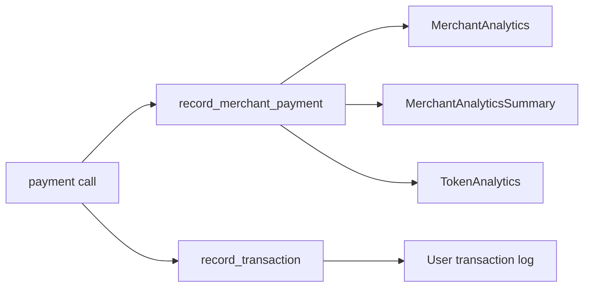

# Merchant analytics and transaction history

The Shade contract accumulates per-[merchant](../glossary.md#merchant), per-token analytics and a per-user transaction log on-chain. This page documents what is tracked, how to read it, and what it does not cover.

## Why it exists

[Merchants](../glossary.md#merchant) and integrators need visibility into on-chain payment volume, fee revenue, and transaction history without relying solely on external indexers. The analytics system provides a read-optimized summary that can be queried directly from the contract.

## How it works

### Analytics recording

Every successful invoice payment or subscription charge calls `record_merchant_payment`, which atomically updates three analytics stores:

1. **Per-merchant, per-token** (`MerchantAnalytics`) — volume, fees, and count for a specific merchant and token pair.
2. **Per-merchant summary** (`MerchantAnalyticsSummary`) — aggregated across all tokens for a given merchant.
3. **Per-token global** (`TokenAnalytics`) — volume, fees, count, and unique merchant count across all merchants using that token.

### Transaction history

Every payment also records a `Transaction` entry in the user's transaction log via `record_transaction`. The log is append-only and grows with each payment.

## Relevant types and storage

| Type / key | Defined in | Purpose |
|---|---|---|
| `MerchantAnalytics` | [`contracts/shade/src/types.rs#L458-L465`](../../../contracts/shade/src/types.rs#L458-L465) | Per-merchant, per-token volume, fees, and count |
| `MerchantAnalyticsSummary` | [`contracts/shade/src/types.rs#L469-L475`](../../../contracts/shade/src/types.rs#L469-L475) | Per-merchant aggregate across all tokens |
| `TokenAnalytics` | [`contracts/shade/src/types.rs#L536-L543`](../../../contracts/shade/src/types.rs#L536-L543) | Global per-token volume, fees, unique merchants |
| `Transaction` | [`contracts/shade/src/types.rs#L555-L563`](../../../contracts/shade/src/types.rs#L555-L563) | Individual transaction record |
| `TransactionType` | [`contracts/shade/src/types.rs#L548-L551`](../../../contracts/shade/src/types.rs#L548-L551) | `InvoicePayment` or `SubscriptionCharge` |

### MerchantAnalytics fields

| Field | Type | When incremented |
|---|---|---|
| `total_volume` | `i128` | Each `record_merchant_payment` call by `volume_amount` |
| `total_fees` | `i128` | Each `record_merchant_payment` call by `fee_amount` |
| `transaction_count` | `u64` | Each `record_merchant_payment` call by 1 |
| `last_updated` | `u64` | Set to current ledger timestamp on each update |

### MerchantAnalyticsSummary fields

| Field | Type | When incremented |
|---|---|---|
| `total_volume` | `i128` | Sum of all per-token volumes for the merchant |
| `total_fees` | `i128` | Sum of all per-token fees for the merchant |
| `transaction_count` | `u64` | Sum of all per-token counts for the merchant |
| `last_updated` | `u64` | Set to current ledger timestamp on each update |

### TokenAnalytics fields

| Field | Type | When incremented |
|---|---|---|
| `total_volume` | `i128` | Sum of all merchants' volume for this token |
| `total_fees` | `i128` | Sum of all merchants' fees for this token |
| `transaction_count` | `u64` | Sum of all merchants' transaction counts for this token |
| `unique_merchants` | `u64` | Distinct merchant count using this token |
| `last_updated` | `u64` | Set to current ledger timestamp on each update |

### Transaction fields

| Field | Type | Description |
|---|---|---|
| `transaction_type` | `TransactionType` | `InvoicePayment` or `SubscriptionCharge` |
| `ref_id` | `u64` | Reference ID (invoice or subscription ID) |
| `amount` | `i128` | Payment amount |
| `token` | `Address` | Token used for payment |
| `description` | `String` | Human-readable description |
| `date` | `u64` | Ledger timestamp of the transaction |
| `merchant_id` | `u64` | ID of the [merchant](../glossary.md#merchant) |

## Relevant functions

| Function | Defined in | Purpose |
|---|---|---|
| `record_merchant_payment` | [`contracts/shade/src/components/admin.rs#L243-L278`](../../../contracts/shade/src/components/admin.rs#L243-L278) | Update analytics after a payment |
| `get_merchant_volume` | [`contracts/shade/src/components/admin.rs#L208-L210`](../../../contracts/shade/src/components/admin.rs#L208-L210) | Read total volume for a merchant/token pair |
| `get_merchant_analytics` | [`contracts/shade/src/components/admin.rs#L212-L228`](../../../contracts/shade/src/components/admin.rs#L212-L228) | Read full analytics for a merchant/token pair |
| `get_merchant_analytics_summary` | [`contracts/shade/src/components/admin.rs#L230-L241`](../../../contracts/shade/src/components/admin.rs#L230-L241) | Read aggregated analytics across all tokens |
| `get_token_analytics` | [`contracts/shade/src/components/admin.rs#L280-L292`](../../../contracts/shade/src/components/admin.rs#L280-L292) | Read global token analytics |
| `get_user_transactions` | [`contracts/shade/src/components/history.rs#L17-L22`](../../../contracts/shade/src/components/history.rs#L17-L22) | Read full transaction log for a user |

## What analytics do not cover

- **Refund adjustments.** Refunds do not reduce `total_volume`, `total_fees`, or `transaction_count`. The analytics reflect gross activity, not net.
- **Off-chain activity.** Payments settled entirely off-chain or through external systems are invisible to on-chain analytics.
- **Event ticketing volume.** Analytics are updated by `record_merchant_payment` (invoice and subscription flows). Ticket purchases use a separate flow and are not reflected in these counters.
- **Expired or pruned data.** On-chain data persists indefinitely; there is no automatic pruning. The `last_updated` field indicates freshness but does not expire.

## On-chain analytics vs. event indexing

| Approach | Cost | Freshness | Completeness |
|---|---|---|---|
| On-chain read (`get_merchant_analytics`) | Low — single contract read | Real-time | Only aggregated summaries |
| Event indexing | Higher — requires off-chain infrastructure | Near real-time | Full event stream with every field |

Use on-chain analytics for dashboards, quick queries, and verification. Use event indexing when you need per-event granularity, historical replay, or cross-contract correlation.

> **Note:** The `last_updated` field is set on every payment. If a [merchant](../glossary.md#merchant) has no recent activity, the timestamp reflects the last payment, not the current time.

## Related pages

- [Invoices and payment](./payment-payloads-and-routing.md)
- [Auto-withdrawal and merchant settlement](./auto-withdrawal.md)
