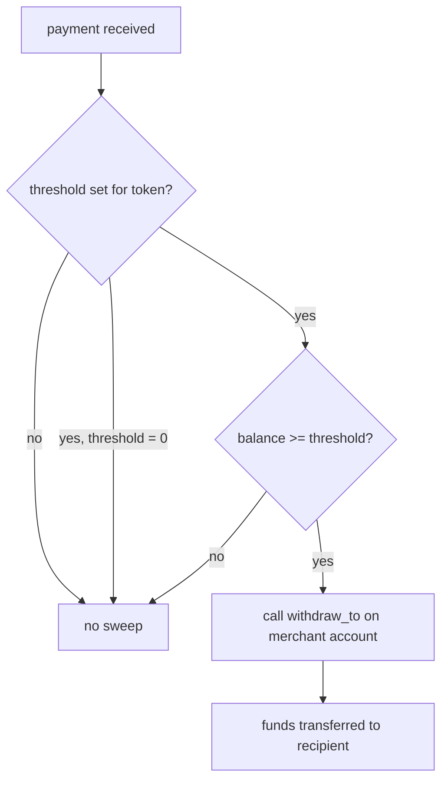

# Auto-withdrawal and merchant settlement

The auto-withdrawal component lets [merchants](../glossary.md#merchant) have funds swept automatically from their Shade account to a destination address when the balance exceeds a configured threshold. This page documents the configuration surface, trigger conditions, settlement path, failure handling, and interaction with merchant account restrictions.

## Why it exists

Without auto-withdrawal, [merchants](../glossary.md#merchant) must manually call `withdraw` on their account contract to move received funds. Auto-withdrawal removes this operational burden by sweeping funds after each payment that pushes the merchant's balance above a per-token threshold.

## How it works

### Configuration

A [merchant](../glossary.md#merchant) configures auto-withdrawal through two functions:

1. **`set_auto_withdrawal_threshold`** — sets a per-token balance threshold. When the merchant account's token balance meets or exceeds this value after a payment, a sweep triggers. Setting the threshold to `0` disables auto-withdrawal for that token.

2. **`set_auto_withdrawal_recipient`** — sets the destination address for swept funds. If no recipient is configured, the [merchant](../glossary.md#merchant)'s own address is used as the default.

Each token has an independent threshold. Two merchants configuring the same token do not interfere with each other.

### Trigger condition

Auto-withdrawal triggers **inline after each invoice payment**, not by an explicit call. The check runs in `check_and_trigger_auto_withdrawal`:

The exact condition: after the payment increases the merchant account's token balance, the contract reads the balance via `token::TokenClient::balance()`. If the balance is ≥ the configured threshold, the sweep executes.

### Settlement path

1. The sweep reads the merchant account address and the token balance.
2. It resolves the recipient — the configured `auto_withdrawal_recipient`, or the [merchant](../glossary.md#merchant) address if none is set.
3. It calls `withdraw_to(token, amount, recipient)` on the merchant account contract, which transfers the full balance.
4. An `AutoWithdrawalTriggeredEvent` is published.

### Failure handling

If `withdraw_to` fails (e.g., the merchant account contract rejects the call), the auto-withdrawal sweep fails silently — it does not revert the enclosing payment transaction. The payment itself is already settled; the sweep is a best-effort follow-up. The merchant's balance remains in the account and can be swept on a subsequent payment or withdrawn manually.

> **Warning:** A failed sweep does not notify the [merchant](../glossary.md#merchant). If sweeps are consistently failing, the merchant should verify the account contract configuration and the recipient address.

## Interaction with merchant account restrictions

Auto-withdrawal interacts with `restrict_merchant_account` as follows:

- **Restricted merchant.** If the [merchant](../glossary.md#merchant) account is restricted (e.g., unverified or flagged), the `withdraw_to` call on the account contract may be rejected. The sweep fails silently, and the payment is not affected.
- **Inactive merchant.** If the [merchant](../glossary.md#merchant) is inactive, `set_auto_withdrawal_threshold` panics — you cannot configure auto-withdrawal for an inactive merchant.

## Configuration reference

| Function | Parameters | Effect |
|---|---|---|
| `set_auto_withdrawal_threshold` | `merchant_address`, `token`, `threshold: i128` | Set per-token sweep threshold; `0` disables |
| `get_auto_withdrawal_threshold` | `merchant_id`, `token` | Read current threshold (`None` if unset, `Some(0)` if disabled) |
| `set_auto_withdrawal_recipient` | `merchant_address`, `recipient: Address` | Set sweep destination |
| `get_auto_withdrawal_recipient` | `merchant_id` | Read current recipient (`None` defaults to merchant address) |

## Auto-withdrawal vs. manual withdrawal

| Aspect | Auto-withdrawal | Manual withdrawal |
|---|---|---|
| Trigger | Automatic after each payment | Explicit `withdraw` call |
| Configuration | Per-token threshold + recipient | None required |
| Recipient | Configurable; defaults to merchant | Specified at call time |
| Failure impact | Does not affect payment | N/A (standalone call) |
| Use case | High-volume [merchants](../glossary.md#merchant) wanting hands-off settlement | Low-volume or one-off withdrawals |

## Constraints and edge cases

- **Negative threshold rejected.** `set_auto_withdrawal_threshold` panics with `InvalidAmount` for negative values.
- **Per-token independence.** Thresholds for different tokens are stored and evaluated independently.
- **Threshold is not cumulative.** The sweep transfers the full account balance, not just the amount above the threshold.
- **No notification on failure.** A failed sweep does not emit an event or revert the payment.

> **Note:** Auto-withdrawal is triggered only by invoice payments. Subscription charges, ticket purchases, and other payment types do not trigger the sweep.

## Related pages

- [Invoices and payment](./payment-payloads-and-routing.md)
- [Merchant analytics and transaction history](./analytics-and-history.md)
