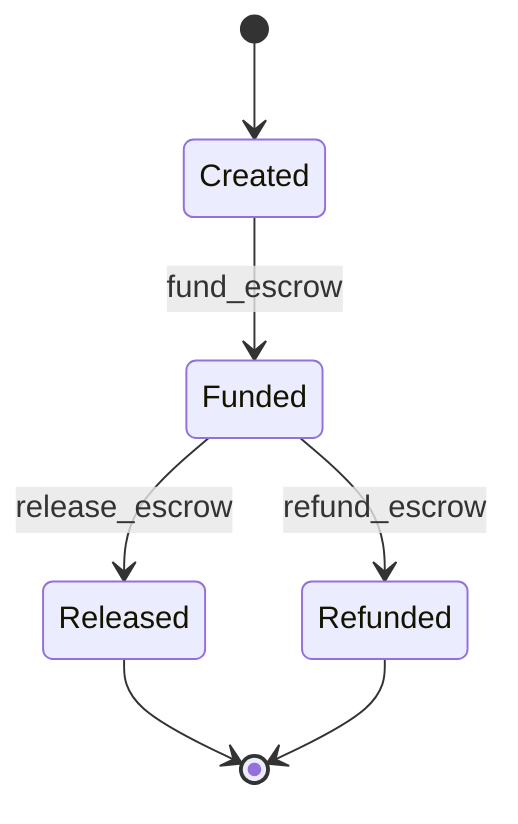

# Escrow

Escrow provides a payment flow in which funds are held by the Shade contract before they are released to the merchant. It is useful when a payer wants payment to be secured before the merchant receives the funds, rather than immediately settling a direct invoice.

> **Implementation note:** The current Shade escrow implementation supports creation, funding, buyer-authorized release, and seller-authorized refund. The current contract does **not** expose an arbiter, dispute, or automatic expiry/refund operation. This page therefore documents the behavior implemented by the contract rather than describing an interface that does not currently exist.

## Why it exists

A direct invoice payment is appropriate when the payer is comfortable with the merchant receiving the payment through the normal invoice flow.

Escrow provides an additional holding stage:

1. The merchant creates the escrow.
2. The payer funds the escrow.
3. The funds remain held by the Shade contract.
4. The payer explicitly releases the escrow.
5. The merchant receives the amount after the applicable platform fee is deducted.

This gives the payer an explicit release decision before the merchant receives the escrowed funds.

Escrow can be associated with an invoice through the optional `invoice_id` field, allowing applications to correlate the escrow with an existing payment request.

## When to use escrow

Use escrow when:

* payment should be held before merchant settlement;
* the payer expects to approve completion before funds are released;
* the merchant and payer need a payment reference that can remain funded before settlement;
* an application wants to associate a protected payment with an invoice.

Use a direct invoice when:

* the payment should settle directly through the normal invoice flow;
* there is no need for a separate funding and release stage;
* the payer does not need an explicit escrow release step.

Use a subscription when:

* payment is expected to recur at a configured interval;
* the customer grants the contract the allowance required for recurring charges;
* an off-chain operator is responsible for invoking the recurring charge operation.

See [Subscriptions and recurring billing](./subscriptions.md) for the recurring-payment model.

## How it works

### 1. Create the escrow

The seller calls `create_escrow`.

```text
seller
  |
  | create_escrow(seller, buyer, token, amount, invoice_id)
  | seller authorization required
  v
Shade contract
  |
  v
EscrowStatus::Created
```

The contract verifies:

* the requested amount is greater than zero;
* the token is globally accepted;
* the seller is a registered merchant.

The escrow receives a monotonically increasing ID and stores:

* buyer;
* seller;
* token;
* amount;
* optional invoice ID;
* creation timestamp;
* current status.

The initial status is `Created`.

### 2. Fund the escrow

The buyer calls `fund_escrow`.

```text
buyer
  |
  | fund_escrow(escrow_id)
  | buyer authorization required
  v
Shade contract
  |
  | token transfer
  v
EscrowStatus::Funded
```

The buyer must match the buyer address stored in the escrow.

The contract transfers the escrow amount from the buyer to the Shade contract address. The escrow then changes from `Created` to `Funded` and records the funding timestamp.

### 3. Release the escrow

The buyer calls `release_escrow`.

The buyer must authorize the call and must match the buyer stored in the escrow.

The contract then:

1. Loads the merchant settlement account.
2. Calculates the applicable platform fee.
3. Transfers the amount minus the fee to the merchant account.
4. Transfers the fee to the platform account.
5. Records the merchant payment for analytics.
6. Changes the escrow status to `Released`.
7. Records the release timestamp.
8. Emits the escrow release event.

The fee is therefore taken at release time rather than when the escrow is initially funded.

### Fee calculation

For an escrow amount `A` and calculated platform fee `F`:

```text
merchant settlement = A - F
platform fee        = F
```

The release operation records the original escrow amount as merchant payment volume while separately recording the fee. This means escrow releases contribute to merchant and token analytics.

### 4. Refund

The current implementation also exposes `refund_escrow`.

The seller must authorize the call and must match the seller stored in the escrow.

The escrow must currently be `Funded`.

The contract transfers the entire escrow amount from the Shade contract back to the buyer and changes the status to `Refunded`.

No platform fee is calculated during this refund path.

## Escrow lifecycle

The currently implemented state machine is:



An escrow cannot be funded twice, released before funding, or refunded after it has already been released/refunded because the contract requires the expected escrow status for each operation.

## Authorization model

| Operation        | Authorized party | Required condition                           |
| ---------------- | ---------------- | -------------------------------------------- |
| `create_escrow`  | Seller           | Seller authorizes the call and is registered |
| `fund_escrow`    | Buyer            | Buyer matches the escrow buyer               |
| `release_escrow` | Buyer            | Buyer matches the escrow buyer               |
| `refund_escrow`  | Seller           | Seller matches the escrow seller             |
| `get_escrow`     | Any caller       | Read operation                               |

The implementation does not currently expose an arbiter role or arbiter authorization path.

## Disputes

The current escrow implementation does not contain a dispute operation, dispute state, arbiter address, or arbiter-controlled resolution function.

Consequently, applications integrating the current contract should not represent an escrow as having an on-chain dispute-resolution guarantee.

A future dispute implementation would need to define at minimum:

* who can open a dispute;
* when an escrow becomes disputed;
* who is authorized to resolve it;
* whether the arbiter can split funds;
* whether the merchant or buyer can appeal;
* how fees are handled during a disputed resolution;
* which terminal states are possible.

Until such functionality exists in the contract, these rules belong to a future protocol change rather than the current escrow interface.

## Expiry and refunds

The current `Escrow` record does not contain an expiry timestamp. The current `EscrowStatus` enum also has no expired state, and the current escrow component does not expose an automatic expiry/refund function.

Therefore, the current contract does not provide an on-chain equivalent of an automatic `test_expired_escrow_refund` flow.

Applications should not assume that an unfunded or funded escrow will automatically return funds after a deadline.

If expiry is introduced later, the implementation should define:

* the expiry timestamp;
* whether only funded escrows can expire;
* who may trigger the expiry operation;
* whether the refund is permissionless;
* the exact terminal status;
* fee treatment;
* emitted events.

## Relevant types and storage

| Type / key                   | Defined in                                                           | Purpose                                                                                  |
| ---------------------------- | -------------------------------------------------------------------- | ---------------------------------------------------------------------------------------- |
| `Escrow`                     | [`contracts/shade/src/types.rs`](../../contracts/shade/src/types.rs) | Stores the escrow participants, token, amount, status, invoice reference, and timestamps |
| `EscrowStatus`               | [`contracts/shade/src/types.rs`](../../contracts/shade/src/types.rs) | Represents the current escrow lifecycle state                                            |
| `DataKey::Escrow`            | [`contracts/shade/src/types.rs`](../../contracts/shade/src/types.rs) | Persistent storage key for an individual escrow                                          |
| `DataKey::EscrowCount`       | [`contracts/shade/src/types.rs`](../../contracts/shade/src/types.rs) | Stores the escrow ID counter                                                             |
| `DataKey::MerchantAnalytics` | [`contracts/shade/src/types.rs`](../../contracts/shade/src/types.rs) | Stores per-merchant/per-token payment analytics                                          |

## Relevant functions

| Function         | Defined in                                                                                   | Purpose                                                  |
| ---------------- | -------------------------------------------------------------------------------------------- | -------------------------------------------------------- |
| `create_escrow`  | [`contracts/shade/src/components/escrow.rs`](../../contracts/shade/src/components/escrow.rs) | Creates a new escrow in `Created` state                  |
| `get_escrow`     | [`contracts/shade/src/components/escrow.rs`](../../contracts/shade/src/components/escrow.rs) | Loads an escrow by ID                                    |
| `fund_escrow`    | [`contracts/shade/src/components/escrow.rs`](../../contracts/shade/src/components/escrow.rs) | Transfers buyer funds into the escrow                    |
| `release_escrow` | [`contracts/shade/src/components/escrow.rs`](../../contracts/shade/src/components/escrow.rs) | Settles the escrow to the merchant after fee calculation |
| `refund_escrow`  | [`contracts/shade/src/components/escrow.rs`](../../contracts/shade/src/components/escrow.rs) | Returns funded escrow funds to the buyer                 |

## Constraints and edge cases

* The escrow amount must be positive.
* The escrow token must be globally accepted.
* The seller must be a registered merchant.
* Only the stored buyer can fund or release an escrow.
* Only the stored seller can refund an escrow.
* Release requires the escrow to be `Funded`.
* Refund requires the escrow to be `Funded`.
* A released or refunded escrow cannot be processed again through these operations.
* The platform fee is applied during release.
* The current refund path returns the full escrow amount and does not calculate a platform fee.
* The current implementation has no arbiter/dispute state.
* The current implementation has no expiry timestamp or automatic expiry refund.

## Related pages

* [Escrow contract reference](../contracts/escrow.md)
* [Subscriptions and recurring billing](./subscriptions.md)
* [Token whitelisting](./token-whitelisting.md)
* [Invoices and invoice payments](../contracts/README.md)
