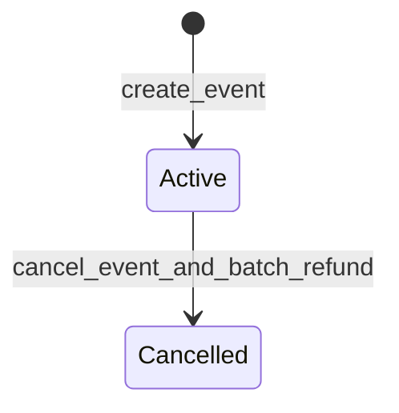

# Event ticketing, dynamic pricing, and resale

The Shade hub exposes an event ticketing surface — `create_event`, `purchase_ticket`, `configure_dynamic_pricing`, `get_current_ticket_price`, `resell_ticket`, and `cancel_event_and_batch_refund` — backed by `Event`, `Ticket`, and `EventStatus` types. This page documents the domain, pricing mechanics, and cancellation/refund behaviour.

## Why it exists

Event organizers need a way to sell tickets with capacity limits, dynamic pricing, and resale support, all settled on-chain through Shade [merchant](../glossary.md#merchant) accounts. Dynamic pricing lets organizers capture early-bird demand and late-buyer premiums without off-chain price oracles.

## How it works

### Event creation

A [merchant](../glossary.md#merchant) calls `create_event` with a name, ticket price, settlement token, capacity, event date, and royalty basis points. The contract stores the event and returns a monotonically increasing `event_id`. The `event_date` must be in the future; capacity and royalty are validated at creation.



### Dynamic pricing

The merchant configures early-bird and late-markup pricing via `configure_dynamic_pricing`. The current ticket price is derived at query time by `get_current_ticket_price` using the formula in `resolve_current_ticket_price`:

```
NOW = env.ledger().timestamp()
BASE = event.ticket_price

if early_bird_end != 0 AND NOW <= early_bird_end:
    price = BASE - (BASE * early_bird_discount_bps / 10_000)
elif early_bird_end != 0 AND NOW > early_bird_end:
    price = BASE + (BASE * late_markup_bps / 10_000)
else:
    price = BASE
```

**Worked examples:**

1. **Early bird active.** Base price = 1000, early_bird_discount_bps = 2000 (20%), early_bird_end has not passed.
   `price = 1000 - (1000 * 2000 / 10_000) = 1000 - 200 = 800`

2. **Late markup active.** Base price = 1000, late_markup_bps = 5000 (50%), early_bird_end has passed.
   `price = 1000 + (1000 * 5000 / 10_000) = 1000 + 500 = 1500`

3. **No dynamic pricing.** `early_bird_end` is 0; price equals `BASE` regardless of timestamp.

### Ticket purchase

`purchase_ticket` transfers the current ticket price from the buyer to the [merchant](../glossary.md#merchant) account, increments `event.sold`, and mints a `Ticket` record. A platform fee is routed to the platform account when configured. Bulk purchases via `purchase_tickets_bulk` apply group discounts:

| Quantity | Discount (basis points) |
|----------|------------------------|
| 5–9      | 500 (5%)              |
| 10–19    | 1,000 (10%)           |
| 20+      | 1,500 (15%)           |

### Resale

`resell_ticket` transfers ownership of a ticket between two addresses. The sale price is split: a royalty (in basis points of the sale price, as configured on the event) goes to the [merchant](../glossary.md#merchant), and the remainder goes to the seller. Setting `royalty_bps` to 0 pays the seller in full.

### Cancellation and batch refund

`cancel_event_and_batch_refund` marks the event as cancelled and refunds all ticket holders by iterating through the stored ticket list. The event cannot be cancelled twice; subsequent calls panic with error `#16`. Once cancelled, no new tickets can be purchased.

## Relevant types and storage

| Type / key | Defined in | Purpose |
|---|---|---|
| `Event` | [`contracts/shade/src/types.rs#L604-L627`](../../../contracts/shade/src/types.rs#L604-L627) | Event details: name, price, capacity, pricing parameters, cancellation state |
| `Ticket` | [`contracts/shade/src/types.rs#L631-L638`](../../../contracts/shade/src/types.rs#L631-L638) | Ticket record: owner, event, purchase price, mint timestamp |
| `EventStatus` | [`contracts/shade/src/types.rs#L597-L603`](../../../contracts/shade/src/types.rs#L597-L603) | `Active` or `Cancelled` |
| `TicketListing` | [`contracts/shade/src/types.rs#L1570-L1575`](../../../contracts/shade/src/types.rs#L1570-L1575) | Resale listing: seller, price, ticket ID |
| `EventKey` | [`contracts/shade/src/types.rs#L89-L98`](../../../contracts/shade/src/types.rs#L89-L98) | Storage key variants for event data |

## Relevant functions

| Function | Defined in | Purpose |
|---|---|---|
| `create_event` | [`contracts/shade/src/components/event.rs#L13-L22`](../../../contracts/shade/src/components/event.rs#L13-L22) | Create a new event with capacity, pricing, and royalty |
| `purchase_ticket` | [`contracts/shade/src/components/event.rs#L109`](../../../contracts/shade/src/components/event.rs#L109) | Transfer funds and mint a ticket |
| `configure_dynamic_pricing` | [`contracts/shade/src/components/event.rs#L200-L207`](../../../contracts/shade/src/components/event.rs#L200-L207) | Set early-bird and late-markup parameters |
| `get_current_ticket_price` | [`contracts/shade/src/components/event.rs#L239`](../../../contracts/shade/src/components/event.rs#L239) | Query the dynamically computed ticket price |
| `resell_ticket` | [`contracts/shade/src/components/event.rs#L287-L293`](../../../contracts/shade/src/components/event.rs#L287-L293) | Transfer ticket ownership with royalty split |
| `cancel_event_and_batch_refund` | [`contracts/shade/src/components/event.rs#L244`](../../../contracts/shade/src/components/event.rs#L244) | Cancel event and refund all ticket holders |
| `purchase_tickets_bulk` | [`contracts/shade/src/components/event.rs#L448-L455`](../../../contracts/shade/src/components/event.rs#L448-L455) | Purchase multiple tickets with group discounts |

## Constraints and edge cases

- **Zero price or capacity rejected.** `create_event` panics with error `#7` (zero price) or `#122` (zero capacity).
- **Royalty cap.** Royalty must be ≤ 10,000 bps (100%); higher values panic with error `#124`.
- **Past event date rejected.** `event_date` must be ≥ current ledger timestamp (error `#123`).
- **Sold out.** `purchase_ticket` panics with error `#121` when `sold >= capacity`.
- **Non-owner resale rejected.** Error `#126` when the seller does not own the ticket.
- **Zero resale price rejected.** Error `#127` for zero resale price.
- **Unknown ticket/event.** Errors `#125` and `#120` respectively.
- **Double cancellation.** Panics with error `#16` if the event is already cancelled.
- **No purchase after cancellation.** Attempts to buy a ticket after the event is cancelled panic.

> **Note:** The dynamic pricing formula is evaluated at query time (`get_current_ticket_price`) and at purchase time. The price is not locked at event creation.

## Related pages

- [Auto-withdrawal and merchant settlement](./auto-withdrawal.md)
- [Payment payloads, swap routing, and the cross-chain bridge placeholder](./payment-payloads-and-routing.md)
