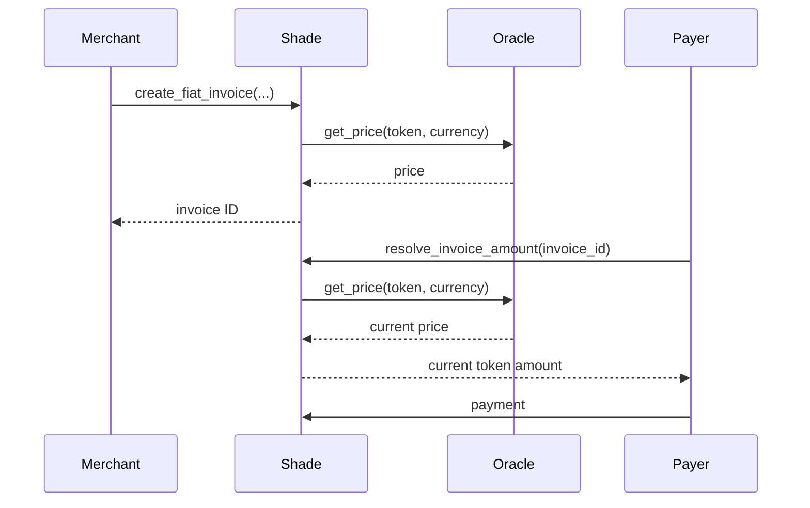

# Fiat Pricing and Oracles

Shade supports invoices whose economic price is denominated in fiat while settlement occurs in a Stellar/Soroban token.

A fiat-priced invoice stores the fiat amount and currency while using a configured token oracle to determine the token amount required at resolution time.

## Why it exists

Token-denominated invoices are predictable in token units but expose the merchant to token price volatility.

A merchant may instead want to quote:

```text
USD 100
```

while allowing the customer to settle using a supported token such as a stablecoin or another accepted asset.

Fiat pricing separates:

* the merchant's quoted economic value; and
* the token amount required for settlement.

The token amount is determined through the configured oracle when the invoice is created or when its amount is resolved before payment.

## Pricing modes

Shade supports two invoice pricing modes:

| Mode          | Meaning                                                   |
| ------------- | --------------------------------------------------------- |
| `FixedCrypto` | Invoice amount is fixed directly in token base units      |
| `FixedFiat`   | Invoice amount is derived from fiat pricing and an oracle |

The invoice stores both the pricing mode and the associated fiat pricing data.

## FiatPricing

`FiatPricing` contains:

| Field      | Meaning                                             |
| ---------- | --------------------------------------------------- |
| `currency` | Fiat quote currency, such as `USD`                  |
| `amount`   | Fiat amount in the specified decimal representation |
| `decimals` | Decimal precision used by the fiat amount           |

For example, a USD 100.00 invoice using two fiat decimals can be represented as:

```text
currency = "USD"
amount   = 10000
decimals = 2
```

The semantic fiat value is:

```text
10000 / 10² = 100.00 USD
```

## FiatPricingData

Soroban's contract type representation uses:

```text
FiatPricingData::None
FiatPricingData::Some(FiatPricing)
```

A fixed-crypto invoice uses `None`.

A fiat-priced invoice uses `Some(FiatPricing)`.

## Creating a fiat invoice

The merchant calls:

```text
create_fiat_invoice(
    merchant,
    description,
    fiat_amount,
    fiat_currency,
    fiat_decimals,
    token,
    expires_at
)
```

The merchant must authorize the operation.

The contract:

1. validates that the fiat amount is positive;
2. creates the fiat pricing record;
3. obtains the token's oracle configuration;
4. reads the current oracle price;
5. converts the fiat amount into token base units;
6. validates the resulting token amount and payment token;
7. stores the invoice as `FixedFiat`.

## Oracle configuration

Each accepted token can have an associated `OracleConfig`.

The structure contains:

| Field            | Meaning                                   |
| ---------------- | ----------------------------------------- |
| `contract`       | Oracle contract address                   |
| `price_decimals` | Decimal precision of the oracle price     |
| `token_decimals` | Decimal precision of the settlement token |

The configuration is stored under:

```text
DataKey::TokenOracle(token)
```

## Registering an oracle

The administrator calls:

```text
set_token_oracle(admin, token, oracle_config)
```

The administrator must authorize the call.

The token must already be globally accepted.

The configuration is then stored for that token.

An application can read the configuration with:

```text
get_token_oracle(token)
```

## Price resolution

The contract uses the oracle's:

```text
get_price(token, quote_currency)
```

operation.

The quote currency comes from the invoice's `FiatPricing.currency`.

For example:

```text
invoice currency = USD
```

causes the oracle to be queried for the token's price against USD.

## Conversion formula

The implementation computes the token amount using:

```text
numerator =
    fiat_amount
    × 10^token_decimals
    × 10^price_decimals

denominator =
    oracle_price
    × 10^fiat_decimals

token_amount =
    numerator / denominator
```

The calculation uses integer arithmetic.

Because integer division is used, the result is rounded toward zero rather than rounded upward.

## Worked example

Assume:

```text
Fiat amount:
    100 USD

fiat_decimals:
    2

token_decimals:
    6

price_decimals:
    8

oracle price:
    1 USD = 2 token units
```

The represented values are:

```text
fiat_amount = 10,000
oracle_price = 200,000,000
```

The calculation is:

```text
numerator =
    10,000
    × 10^6
    × 10^8

    = 10^18

denominator =
    200,000,000
    × 10^2

    = 2 × 10^10

token_amount =
    10^18 / (2 × 10^10)

    = 50,000,000
```

With six token decimals:

```text
50,000,000 base units = 50 tokens
```

So the contract resolves a USD 100 invoice to 50 settlement tokens at the assumed oracle price.

## When the oracle is read

For a newly created fiat invoice, the contract resolves the token amount while creating the invoice.

For an existing fiat invoice that has not yet received payment, `resolve_invoice_amount` can resolve the fiat amount again using the current oracle price.

The invoice component also refreshes the stored quote before payment when the invoice remains fixed-fiat and has not received payment.

This means the token amount shown by an application should not be treated as permanently fixed merely because the invoice was originally created.

## Price movement

Fiat-priced invoices are exposed to token price movement.

Suppose:

```text
Invoice = USD 100
```

and the token price changes between the initial quote and payment.

The token amount required at resolution may therefore change.

A payer-facing application should:

1. display the fiat amount;
2. display the current token amount;
3. indicate the token and its decimals;
4. refresh/re-quote immediately before submitting payment;
5. avoid assuming that an old token amount remains valid indefinitely.

## Oracle staleness

The current invoice resolution logic checks that the oracle returns a positive price.

It does **not** implement an explicit timestamp-based staleness threshold in `resolve_fiat_invoice_amount`.

Therefore, the contract does not independently guarantee that a positive oracle response is fresh.

Oracle freshness is consequently an important operational and security consideration.

The oracle implementation should provide an appropriate freshness policy, and operators should understand what guarantees the selected oracle actually provides.

## Oracle downtime

If the oracle call cannot provide a valid positive price, fiat invoice resolution fails.

The contract treats a missing/invalid oracle price as an oracle-price-unavailable condition.

A merchant using fiat invoices should therefore have an operational plan for oracle outages.

## Missing oracle configuration

A fiat invoice requires an oracle configuration for its settlement token.

If no usable configuration exists, the fiat amount cannot be converted into token units.

Administrators should configure an oracle before merchants attempt to create fiat-denominated invoices for a token.

## Price movement and payer UX

A frontend should not rely on a stale quote.

A recommended payment flow is:



The UI should clearly communicate that the token amount can move with the oracle price until payment.

## Failure modes

### Non-positive oracle price

If the oracle returns zero or a negative price, resolution fails.

### Oracle unavailable

If a usable oracle price cannot be obtained, the fiat invoice cannot be resolved.

### Price movement

The token amount can change as the oracle price changes.

### Integer rounding

The conversion uses integer division. Any fractional remainder is discarded.

### Incorrect decimal configuration

Incorrect `price_decimals`, `token_decimals`, or fiat decimals can produce an incorrect conversion.

Oracle administrators must therefore configure these values consistently with the oracle and token.

## Relevant types and storage

| Type / key             | Defined in                                                           | Purpose                                          |
| ---------------------- | -------------------------------------------------------------------- | ------------------------------------------------ |
| `InvoicePricingMode`   | [`contracts/shade/src/types.rs`](../../contracts/shade/src/types.rs) | Selects crypto or fiat invoice pricing           |
| `FiatPricing`          | [`contracts/shade/src/types.rs`](../../contracts/shade/src/types.rs) | Stores fiat currency, amount, and precision      |
| `FiatPricingData`      | [`contracts/shade/src/types.rs`](../../contracts/shade/src/types.rs) | Soroban-compatible optional fiat pricing         |
| `OracleConfig`         | [`contracts/shade/src/types.rs`](../../contracts/shade/src/types.rs) | Stores oracle contract and decimal configuration |
| `Invoice`              | [`contracts/shade/src/types.rs`](../../contracts/shade/src/types.rs) | Stores invoice pricing mode and resolved amount  |
| `DataKey::TokenOracle` | [`contracts/shade/src/types.rs`](../../contracts/shade/src/types.rs) | Stores per-token oracle configuration            |

## Relevant functions

| Function                 | Defined in                                                                                     | Purpose                                    |
| ------------------------ | ---------------------------------------------------------------------------------------------- | ------------------------------------------ |
| `create_fiat_invoice`    | [`contracts/shade/src/components/invoice.rs`](../../contracts/shade/src/components/invoice.rs) | Creates an invoice denominated in fiat     |
| `resolve_invoice_amount` | [`contracts/shade/src/components/invoice.rs`](../../contracts/shade/src/components/invoice.rs) | Resolves the current token amount          |
| `set_token_oracle`       | [`contracts/shade/src/components/admin.rs`](../../contracts/shade/src/components/admin.rs)     | Admin registers token oracle configuration |
| `get_token_oracle`       | [`contracts/shade/src/components/admin.rs`](../../contracts/shade/src/components/admin.rs)     | Reads oracle configuration                 |

## Constraints and edge cases

* Fiat amounts must be positive.
* The settlement token must be configured with a usable oracle.
* The token must be globally accepted.
* Oracle prices must be positive.
* Conversion uses integer arithmetic.
* Integer division discards the fractional remainder.
* The current contract does not enforce a timestamp-based oracle staleness threshold.
* Token price movement can change the token amount required for a fiat invoice.
* Oracle downtime can prevent fiat invoice resolution.
* Decimal configuration must match the oracle and token.
* Payers should re-quote immediately before submitting payment.

## Related pages

* [Token whitelisting](./token-whitelisting.md)
* [Escrow](./escrow.md)
* [Contracts](../contracts/README.md)
