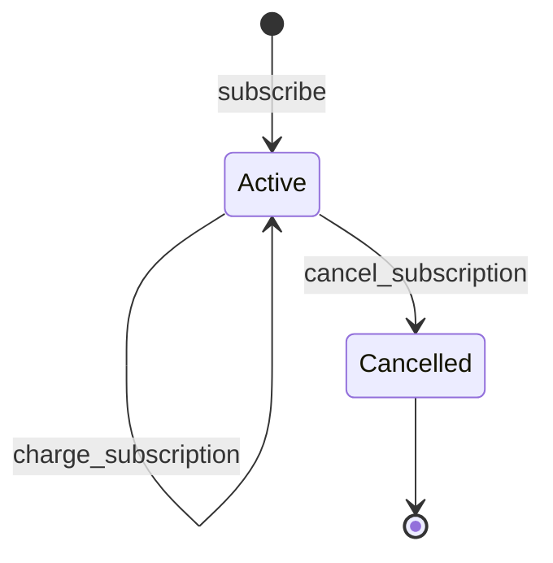

# Subscriptions and Recurring Billing

Shade subscriptions provide recurring token payments between a customer and a merchant. A merchant creates a subscription plan with a token, amount, and billing interval; customers subscribe to active plans; and recurring charges are executed by calling `charge_subscription`.

> **Important:** `charge_subscription` does not require customer authorization at call time. The customer must instead have the allowance required by the underlying payment route. This makes recurring charging suitable for an off-chain crank or scheduler.

## Why it exists

Recurring billing requires a payment model that can repeatedly charge a customer according to a predefined schedule without requiring the merchant to create a new invoice for every billing period.

Shade separates recurring billing into two records:

* `SubscriptionPlan` — merchant-defined pricing and interval configuration.
* `Subscription` — the customer's enrollment in a plan and its current billing state.

The plan controls what should be charged. The subscription records who is enrolled and when the last charge occurred.

## Subscription model



A plan has a separate `active` flag.

Deactivating a plan prevents new subscriptions from being created against that plan, but does not automatically cancel subscriptions that already exist.

## SubscriptionPlan

`SubscriptionPlan` contains:

| Field         | Meaning                                    |
| ------------- | ------------------------------------------ |
| `id`          | Unique plan ID                             |
| `merchant_id` | Numeric merchant ID                        |
| `merchant`    | Merchant address                           |
| `description` | Human-readable plan description            |
| `token`       | Token used for recurring billing           |
| `amount`      | Charge amount in token base units          |
| `interval`    | Billing interval in seconds                |
| `active`      | Whether new subscriptions may use the plan |

The `amount` is represented in the token's base units.

For example, if a token uses six decimals, an amount of `5_000_000` represents `5` whole token units.

## Subscription

`Subscription` contains:

| Field          | Meaning                               |
| -------------- | ------------------------------------- |
| `id`           | Unique subscription ID                |
| `plan_id`      | Plan associated with the subscription |
| `customer`     | Customer who subscribed               |
| `merchant_id`  | Merchant copied from the plan         |
| `status`       | Current subscription status           |
| `date_created` | Subscription creation timestamp       |
| `last_charged` | Timestamp of the most recent charge   |

The current `SubscriptionStatus` enum contains:

| Status      | Meaning                               |
| ----------- | ------------------------------------- |
| `Active`    | Subscription can be charged           |
| `Cancelled` | Subscription can no longer be charged |

## Creating a plan

The merchant calls:

```text
create_subscription_plan(
    merchant,
    description,
    token,
    amount,
    interval
)
```

The merchant must authorize the call.

The contract validates:

* `amount > 0`;
* `interval > 0`;
* the token is globally accepted;
* the merchant exists;
* the configured fee does not exceed the plan amount.

The resulting plan is created with:

```text
active = true
```

The plan receives a monotonically increasing ID.

## Deactivating a plan

The merchant can call:

```text
deactivate_plan(caller, plan_id)
```

The caller must authorize the call and must be the merchant associated with the plan.

Deactivation changes:

```text
active = false
```

It does not cancel existing subscriptions.

Therefore:

* new customers cannot subscribe to the deactivated plan;
* existing subscriptions retain their current status;
* an existing active subscription can still be charged unless it is cancelled.

## Subscribing

The customer calls:

```text
subscribe(customer, plan_id)
```

The customer must authorize the call.

The plan must exist and must be active.

The contract then creates an `Active` subscription and returns the new subscription ID.

### First charge

The current implementation does **not** transfer funds during `subscribe`.

Instead, the newly created subscription has:

```text
last_charged = 0
```

Because `charge_subscription` only applies the interval check when `last_charged > 0`, the first charge is immediately eligible.

Therefore, an integration should treat subscription enrollment and the first recurring charge as separate contract calls.

## Charging a subscription

The recurring payment operation is:

```text
charge_subscription(subscription_id)
```

It does not accept a caller/customer authorization argument.

This means the function is suitable for permissionless crank execution, subject to the customer's existing payment allowance and the underlying payment route.

The caller should therefore be an off-chain scheduler, keeper, worker, or other operator that regularly scans for subscriptions that are due.

### Due-date calculation

The contract uses:

```text
next charge time = last_charged + plan.interval
```

The charge is rejected if:

```text
now < last_charged + interval
```

For the first charge, `last_charged == 0`, so the interval check does not prevent charging.

After a successful charge:

```text
last_charged = current ledger timestamp
```

The next charge is therefore calculated from the timestamp of the previous successful charge.

### Example

Assume:

```text
last_charged = 1,000,000
interval     = 2,592,000
```

The next charge becomes eligible at:

```text
1,000,000 + 2,592,000
= 3,592,000
```

A call before that timestamp is rejected as too early.

## Payment routing and fees

`charge_subscription` obtains the merchant account and routes the plan amount through the platform fee component.

The resulting platform fee is included in the subscription-charged event.

The operation also records a `SubscriptionCharge` transaction in transaction history.

## Insufficient funds or allowance

The recurring charge depends on the customer's allowance/payment capability through the underlying payment route.

If the payment route cannot complete the charge, the transaction does not become a successful recurring charge.

The implementation does not maintain a separate retry counter, retry schedule, grace period, or failed-charge subscription status.

Operators should therefore treat failed calls as operational failures that need to be retried according to the scheduler's policy.

## Scheduler and crank requirements

Because `charge_subscription` is not tied to customer authorization at call time, production deployments need an off-chain process that:

1. discovers active subscriptions;
2. determines which subscriptions are due;
3. submits `charge_subscription(subscription_id)`;
4. records the result;
5. retries failed calls according to an operational policy.

A practical scheduler should run more frequently than the shortest supported billing interval so that due subscriptions are detected promptly.

### Recommended operational cadence

For plans measured in days or weeks, an hourly or similarly frequent scheduler is generally sufficient.

The scheduler should not assume that calling the operation repeatedly is safe without checking the contract's due-date rule. Calls made before the interval has elapsed will fail with the contract's `ChargeTooEarly` condition.

### Idempotency

The scheduler should use the subscription ID as its logical idempotency key for each billing period.

The contract itself prevents a second successful charge before the configured interval because `last_charged` is updated after a successful charge and checked on subsequent calls.

A scheduler should still track transaction hashes and execution results so it can distinguish:

* successfully charged;
* too early;
* insufficient allowance/funds;
* cancelled subscription;
* other contract errors.

## Cancellation

A subscription may be cancelled through:

```text
cancel_subscription(caller, subscription_id)
```

The caller must authorize the operation.

The caller must be either:

* the customer; or
* the merchant associated with the subscription.

An unrelated address cannot cancel the subscription.

Cancellation changes:

```text
status = Cancelled
```

A cancelled subscription can no longer be charged because `charge_subscription` requires the status to be `Active`.

## Plan deactivation versus cancellation

These are different operations:

| Operation             | Affects                 | Existing subscriptions |
| --------------------- | ----------------------- | ---------------------- |
| `deactivate_plan`     | Plan                    | Remain active          |
| `cancel_subscription` | Individual subscription | Becomes cancelled      |

Deactivating a plan is therefore a merchant-level decision to stop accepting new subscribers, while cancellation terminates a specific customer's recurring relationship.

## Relevant types and storage

| Type / key                   | Defined in                                                           | Purpose                                  |
| ---------------------------- | -------------------------------------------------------------------- | ---------------------------------------- |
| `SubscriptionPlan`           | [`contracts/shade/src/types.rs`](../../contracts/shade/src/types.rs) | Stores recurring plan configuration      |
| `Subscription`               | [`contracts/shade/src/types.rs`](../../contracts/shade/src/types.rs) | Stores an individual customer enrollment |
| `SubscriptionStatus`         | [`contracts/shade/src/types.rs`](../../contracts/shade/src/types.rs) | Represents subscription lifecycle        |
| `DataKey::SubscriptionPlan`  | [`contracts/shade/src/types.rs`](../../contracts/shade/src/types.rs) | Persistent plan storage                  |
| `DataKey::Subscription`      | [`contracts/shade/src/types.rs`](../../contracts/shade/src/types.rs) | Persistent subscription storage          |
| `DataKey::PlanCount`         | [`contracts/shade/src/types.rs`](../../contracts/shade/src/types.rs) | Plan ID counter                          |
| `DataKey::SubscriptionCount` | [`contracts/shade/src/types.rs`](../../contracts/shade/src/types.rs) | Subscription ID counter                  |

## Relevant functions

| Function                   | Defined in                                                                                               | Authorization / purpose                     |
| -------------------------- | -------------------------------------------------------------------------------------------------------- | ------------------------------------------- |
| `create_subscription_plan` | [`contracts/shade/src/components/subscription.rs`](../../contracts/shade/src/components/subscription.rs) | Merchant creates an active plan             |
| `get_subscription_plan`    | [`contracts/shade/src/components/subscription.rs`](../../contracts/shade/src/components/subscription.rs) | Reads a plan                                |
| `subscribe`                | [`contracts/shade/src/components/subscription.rs`](../../contracts/shade/src/components/subscription.rs) | Customer creates an active subscription     |
| `get_subscription`         | [`contracts/shade/src/components/subscription.rs`](../../contracts/shade/src/components/subscription.rs) | Reads a subscription                        |
| `charge_subscription`      | [`contracts/shade/src/components/subscription.rs`](../../contracts/shade/src/components/subscription.rs) | Executes a due recurring charge             |
| `cancel_subscription`      | [`contracts/shade/src/components/subscription.rs`](../../contracts/shade/src/components/subscription.rs) | Customer or merchant cancels a subscription |
| `deactivate_plan`          | [`contracts/shade/src/components/subscription.rs`](../../contracts/shade/src/components/subscription.rs) | Merchant stops new subscriptions            |

## Constraints and edge cases

* Plan amounts must be positive.
* Plan intervals must be greater than zero.
* Plan tokens must be globally accepted.
* Only active plans accept new subscriptions.
* `subscribe` creates the subscription but does not perform the first token transfer itself.
* The first charge is immediately eligible because `last_charged` starts at zero.
* Subsequent charges cannot occur before the configured interval.
* Only active subscriptions can be charged.
* A customer or merchant can cancel a subscription.
* Deactivating a plan does not automatically cancel existing subscriptions.
* The contract does not provide a dedicated failed-payment status.
* Off-chain infrastructure is responsible for discovering and submitting due subscription charges.

## Related pages

* [Escrow](./escrow.md)
* [Token whitelisting](./token-whitelisting.md)
* [Fiat pricing and oracles](./fiat-pricing-and-oracles.md)
