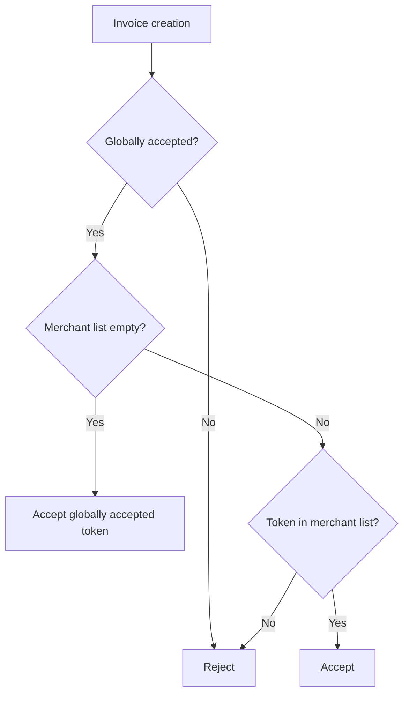

# Token Whitelisting

Shade uses two levels of token acceptance:

1. a protocol-wide whitelist controlled by the administrator; and
2. an optional merchant-specific whitelist controlled by each merchant.

The global list establishes which tokens the protocol accepts. The merchant list can restrict which of those globally accepted tokens a particular merchant is willing to use.

## Why it exists

Token whitelisting protects the payment system from accepting arbitrary assets.

The global whitelist gives protocol administrators control over supported payment assets. The merchant-level whitelist gives individual merchants control over the assets they are willing to accept.

The two layers are intentionally composed so that a merchant cannot enable a token that the protocol itself has rejected.

## Global accepted-token list

The global list is stored under `DataKey::AcceptedTokens`.

Only the protocol administrator can modify it.

### Add one token

```text
add_accepted_token(admin, token)
```

The administrator must authorize the call.

The contract verifies the token's token-client interface by reading its symbol before adding it.

### Add multiple tokens

```text
add_accepted_tokens(admin, tokens)
```

This is the batch equivalent.

Each token is checked and only tokens not already present are added.

### Remove a token

```text
remove_accepted_token(admin, token)
```

The administrator authorizes the removal.

Removing a token means it will no longer satisfy `is_accepted_token`.

### Check a token

```text
is_accepted_token(token)
```

This returns whether the token exists in the protocol-wide accepted-token list.

## Merchant-specific accepted-token list

Each merchant can configure its own list using:

```text
set_merchant_accepted_tokens(merchant, tokens)
```

The merchant must authorize the operation.

Every supplied token must already be globally accepted.

The contract also removes duplicates before storing the merchant list.

### Read the merchant list

```text
get_merchant_accepted_tokens(merchant)
```

Returns the stored merchant-specific token list.

If the merchant has never configured a list, the function returns an empty list.

### Remove a merchant token

```text
remove_merchant_accepted_token(merchant, token)
```

The merchant must authorize the operation.

The token must currently exist in the merchant's configured list.

### Check merchant acceptance

```text
is_token_accepted_for_merchant(merchant, token)
```

This function applies the composition rule described below.

## Composition rule

The payment path performs the following checks:

```text
global whitelist
      |
      | must be accepted
      v
merchant whitelist
      |
      | empty -> accept any globally accepted token
      |
      | non-empty -> token must appear in merchant list
      v
payment accepted
```

The precise rule is:

### Empty merchant list

If the merchant has no configured merchant-specific tokens, the merchant accepts **all globally accepted tokens**.

In other words:

```text
merchant list = []
token accepted = globally accepted
```

### Non-empty merchant list

If the merchant has configured one or more tokens, only tokens present in that list are accepted.

Because `set_merchant_accepted_tokens` only allows globally accepted tokens into the merchant list, the effective set remains a subset of the global whitelist.

Therefore:

```text
effective merchant tokens =
    global tokens ∩ merchant tokens
```

with the special case that an empty merchant list means:

```text
effective merchant tokens = global tokens
```

## Payment-time validation

Invoice creation validates the global whitelist first:

```text
is_accepted_token(token)
```

It then validates merchant acceptance:

```text
is_token_accepted_for_merchant(merchant, token)
```

A token therefore needs to satisfy both levels when the merchant has configured a non-empty list.

## Removing a globally accepted token

Removing a token from the global list immediately causes that token to fail the global acceptance check for new payment operations.

A merchant-specific list does not override the global whitelist.

For example:

```text
Global tokens:
USDC, XLM, EURC

Merchant tokens:
USDC, EURC
```

If the administrator removes `USDC` globally:

```text
Global tokens:
XLM, EURC

Merchant tokens:
USDC, EURC
```

`USDC` is no longer accepted for new invoice creation because the global check fails.

## Open invoices

Removing a token from the accepted-token list does not rewrite existing invoice records.

Existing invoices retain their stored token and amount.

However, integrations should not assume that de-listing a token leaves every future operation unaffected. New invoice creation and other operations that explicitly validate token acceptance can reject the removed asset.

Applications should therefore distinguish between:

* the token stored on an existing invoice;
* whether the token is currently accepted for creating new payment requests.

## Token requirements

The global whitelist implementation interacts with the token contract through Soroban's token client.

When a token is added, the contract attempts to read its symbol. This provides an early compatibility check for the expected token interface.

Applications should therefore use standards-compliant Stellar/Soroban token contracts.

## Decimals

Token amounts are represented in the token's base units.

The whitelist itself does not normalize or convert token decimals. Decimal handling belongs to the payment amount and token integration layers.

For example, if a token has six decimal places:

```text
1 token = 1,000,000 base units
```

A merchant or frontend must therefore format amounts according to the token's actual decimal configuration.

## Fee-on-transfer and rebasing tokens

Payment integrations should be cautious with tokens whose transfer behavior differs from standard balance accounting.

Examples include:

* fee-on-transfer tokens;
* rebasing tokens;
* tokens whose balance can change without a direct transfer.

The whitelist only establishes that a token is accepted. It does not guarantee that every non-standard token transfer behavior is economically equivalent to a standard SEP-41 transfer.

Protocol administrators should therefore evaluate token behavior before adding an asset to the global whitelist.

## Relevant storage

| Storage key               | Defined in                                                           | Purpose                                        |
| ------------------------- | -------------------------------------------------------------------- | ---------------------------------------------- |
| `DataKey::AcceptedTokens` | [`contracts/shade/src/types.rs`](../../contracts/shade/src/types.rs) | Stores protocol-wide accepted tokens           |
| `DataKey::MerchantTokens` | [`contracts/shade/src/types.rs`](../../contracts/shade/src/types.rs) | Stores a merchant's optional token restriction |

## Relevant functions

| Function                         | Defined in                                                                                       | Authorization / purpose                               |
| -------------------------------- | ------------------------------------------------------------------------------------------------ | ----------------------------------------------------- |
| `add_accepted_token`             | [`contracts/shade/src/shade.rs`](../../contracts/shade/src/shade.rs)                             | Admin adds one global token                           |
| `add_accepted_tokens`            | [`contracts/shade/src/shade.rs`](../../contracts/shade/src/shade.rs)                             | Admin adds multiple global tokens                     |
| `remove_accepted_token`          | [`contracts/shade/src/shade.rs`](../../contracts/shade/src/shade.rs)                             | Admin removes a global token                          |
| `is_accepted_token`              | [`contracts/shade/src/shade.rs`](../../contracts/shade/src/shade.rs)                             | Checks global token acceptance                        |
| `set_merchant_accepted_tokens`   | [`contracts/shade/src/components/merchant.rs`](../../contracts/shade/src/components/merchant.rs) | Merchant replaces its token list                      |
| `get_merchant_accepted_tokens`   | [`contracts/shade/src/components/merchant.rs`](../../contracts/shade/src/components/merchant.rs) | Reads merchant token configuration                    |
| `remove_merchant_accepted_token` | [`contracts/shade/src/components/merchant.rs`](../../contracts/shade/src/components/merchant.rs) | Merchant removes one configured token                 |
| `is_token_accepted_for_merchant` | [`contracts/shade/src/components/merchant.rs`](../../contracts/shade/src/components/merchant.rs) | Applies the effective merchant/global acceptance rule |

## Payment validation flow

Invoice creation performs:



## Constraints and edge cases

* Only the administrator can modify the global whitelist.
* Only merchants can modify their own merchant-specific list.
* Merchant-specific tokens must already be globally accepted.
* Duplicate merchant tokens are removed during configuration.
* An empty merchant list means all globally accepted tokens are allowed.
* A non-empty merchant list restricts the merchant to those tokens.
* A merchant list cannot override global removal.
* The whitelist does not convert token decimals.
* The whitelist does not guarantee standard transfer economics for unusual token implementations.

## Related pages

* [Fiat pricing and oracles](./fiat-pricing-and-oracles.md)
* [Escrow](./escrow.md)
* [Contracts](../contracts/README.md)
