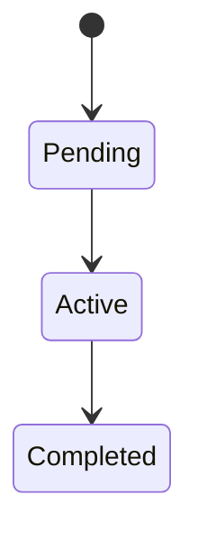

<!--
Concept template — use for pages that explain a domain idea or mechanism
(e.g. "Time-Locked Fees," "Reentrancy Guard," "Dynamic Pricing").
Delete this comment block before publishing the page.
See docs/contributing/documentation-style-guide.md for tone/format rules.
-->

# <Concept name>

One or two sentences: what this concept is and why Shade needs it.

## Why it exists

Explain the problem this concept solves. Reference the specific risk, constraint, or prior bug it addresses if one motivated it (e.g. "a monolithic `DataKey` enum exceeded Soroban's 50-case cap").

## How it works

Explain the mechanism step by step. Use a numbered list for sequential logic, a Mermaid diagram for state transitions or cross-contract flow.

## Relevant types and storage

List the types and storage keys involved, with source links.

| Type / key | Defined in | Purpose |
|---|---|---|
| `ExampleType` | [`contracts/shade/src/types.rs`](../../../contracts/shade/src/types.rs) | One-line purpose |

## Relevant functions

| Function | Defined in | Purpose |
|---|---|---|
| `example_fn` | [`contracts/shade/src/interface.rs`](../../../contracts/shade/src/interface.rs) | One-line purpose |

## Constraints and edge cases

Document limits, invariants, and failure modes a reader must know to use this concept correctly (e.g. "cannot be called twice," "requires admin auth," "panics if the interval has not elapsed").

> **Note:** Use callouts per the [style guide](../documentation-style-guide.md#callouts) for anything a reader could easily miss.

## Related pages

- [Related concept or reference page](#)
