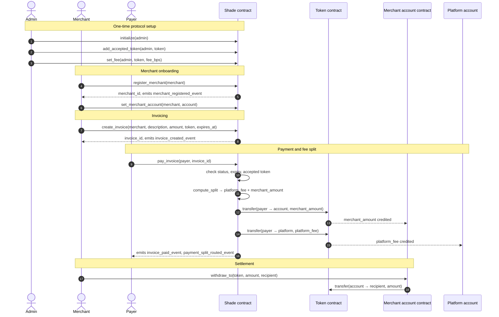

# Introduction — what Shade is and how it works

Shade is a payment protocol implemented entirely as smart contracts on Stellar's Soroban platform. A business registers once, issues an invoice, and gets paid in a whitelisted token — with the protocol's fee split out and routed automatically, and no intermediary holding the money in between.

This page is the starting point for everyone: it explains the problem Shade solves, who the participants are, how value moves end to end, and what each contract in the repository does. Every other page in these docs assumes you have read it. No Rust knowledge is needed here.

## The problem

Accepting payment across borders is expensive and slow, and the cost falls hardest on the businesses least able to absorb it:

- **Intermediaries take a cut and set the rules.** Card networks, acquirers, and payment service providers each price their layer in, and each can freeze or reverse a settlement on their own terms.
- **Settlement takes days.** Money that a customer has already paid sits in transit, and the merchant carries the gap.
- **Access is uneven.** Whether a business can accept payment at all depends on its jurisdiction, its banking relationships, and its risk category — not on whether it has customers.
- **Existing crypto payment tooling reintroduces the intermediary.** Most "crypto checkout" products are custodial: funds land with the processor, and the merchant is back to trusting a third party for release.

## The solution

Shade puts the payment gateway itself on chain. The rules that a payment processor would normally enforce in its own database — who is a registered merchant, what an invoice is worth, what fee applies, where the money goes — are enforced by a Soroban contract that anyone can read and no one can quietly change.

Three properties follow from that design:

- **Non-custodial settlement.** The protocol never holds the payment. When a [payer](../glossary.md#payer) settles an invoice, the token contract moves funds directly from the payer to the [merchant](../glossary.md#merchant)'s account contract and to the platform's fee account, in the same transaction. There is no intermediate balance for the protocol to sit on, lose, or freeze.
- **Deterministic, auditable fees.** The [protocol fee](../glossary.md#protocol-fee) is basis points on the gross amount, resolved from on-chain configuration at payment time and emitted in an event. Fee changes go through a time lock (`propose_fee`, then `execute_fee`), so a merchant can see a change coming.
- **Fast and cheap by construction.** Stellar settles in seconds at negligible cost, and the contracts are compiled for minimum size and instruction count (see [Building the Contracts](building.md#release-profile-settings)).

On top of that payment core, the repository adds the commerce primitives that merchants actually need: recurring [subscriptions](../glossary.md#subscription), event [ticketing](../glossary.md#ticket), two-party [escrow](../glossary.md#escrow), and crowdfunding campaigns.

## Non-goals

Being explicit about what Shade does *not* do is as useful as describing what it does.

| Not a goal | What that means in practice |
|---|---|
| **Fiat custody, on-ramp, or off-ramp** | Shade can *price* an invoice in a fiat currency through an [oracle config](../glossary.md#oracle-config), but the invoice always settles in a token. No contract in this repository touches a bank. |
| **Executing token swaps** | A payment payload can *describe* a [swap route](../glossary.md#swap-route) — input token, settlement token, path, slippage — and the contract validates that description. It does not perform the swap; routing is left to an integrator or an external AMM. |
| **Issuing tokens** | Shade settles in tokens issued elsewhere. The [admin](../glossary.md#admin) whitelists which ones are acceptable; the protocol mints nothing. |
| **Being a wallet** | Shade holds no user keys and offers no key management. Payers and merchants bring their own Stellar accounts. |
| **General-purpose identity or full KYC** | The protocol records a verification flag and a KYC request lifecycle that reviewers act on. It does not collect, store, or validate identity documents on chain — that work happens off chain, and only the resulting status is recorded. |
| **Reversing settled payments unilaterally** | There is no chargeback. Refunds are explicit contract calls made by the party holding the funds; escrow exists for deals that need a hold before release. |
| **Off-chain infrastructure** | Dashboards, SDKs, notification services, and bridge listeners live outside this repository. Shade emits events; those systems consume them. |

## The actors

Four roles appear throughout the protocol and the rest of these docs.

### Admin — the protocol operator

The single address stored under `DataKey::Admin`, set once by `initialize` and thereafter handed over only through a two-step propose/accept transfer. The admin governs the protocol, not any individual payment.

The admin can whitelist and remove [accepted tokens](../glossary.md#accepted-token), set and time-lock protocol fees per token, designate the platform fee account, configure price oracles, activate and verify merchants, restrict a merchant account, pause and unpause the whole contract, register governance council members, set the account contract's WASM hash, and upgrade the contract's code.

The admin **cannot** move a merchant's funds. Balances live in each merchant's own account contract, and only the merchant authorizes a withdrawal from it.

### Merchant — the business getting paid

Any address that calls `register_merchant`. Registration is permissionless: it self-authorizes, and the new merchant record starts `active: true` and `verified: false`. Verification is a separate admin action that gates the features requiring it.

A merchant designates a settlement account (`set_merchant_account`), creates and manages [invoices](../glossary.md#invoice), publishes [subscription plans](../glossary.md#subscription-plan), issues event tickets, opens escrows and campaigns, narrows which tokens it will accept, and withdraws its balance from its account contract.

### Payer — the customer

Any address paying a merchant. Payers do not register and hold no protocol role; the only requirement is authorizing the payment. A payer settles an invoice in full (`pay_invoice`), in part (`pay_invoice_partial`), or several at once (`pay_invoices_batch`), subscribes to a plan and authorizes recurring billing, buys tickets, funds escrow, and pledges to campaigns.

### Platform — the fee recipient

The address stored under `DataKey::PlatformAccount`, set to the admin at `initialize` and changeable by the admin with `set_platform_account`. It is purely a destination: the platform's share of every payment is transferred to it directly by the token contract. The platform account holds no authority over merchants, invoices, or protocol configuration — separating "who runs the protocol" from "who is paid by it."

## The happy path

Here is the end-to-end flow for the core case — a merchant registering, issuing an invoice, and being settled — showing exactly where the fee is split.

The diagram shows one full payment, from a merchant's first registration through to the merchant withdrawing the proceeds.

Three things in that diagram are worth stating plainly, because they are what make Shade non-custodial:

- **The Shade contract never receives the money.** It computes the split and instructs the token contract; the transfers run payer → merchant account and payer → platform account. At no point is there a Shade-held balance.
- **The fee is deducted from the gross, not added to it.** The payer is debited `amount`; the merchant account receives `amount − platform_fee`. The effective rate can be lower than the configured rate — per-merchant overrides and volume-based discounts both apply — and the rate actually used is recorded in the emitted event.
- **The merchant's funds sit in a contract the merchant controls.** The [merchant account](../glossary.md#merchant-account) is a separate deployed contract holding balances per token; withdrawing requires the merchant's own authorization, and only the withdrawal threshold and restriction flag can stand in the way.

## The contract suite

Nine crates live under [`contracts/`](../../contracts/). `shade` is the hub; the rest are either the per-merchant account or standalone contracts deployed per deal, per event, or per campaign — usually through a matching factory.

| Crate | Role | Reference |
|---|---|---|
| [`shade`](../../contracts/shade/) | The hub contract. Owns admin config, accepted tokens, fees, merchants, invoices, payment routing, and the on-hub subscription, escrow, ticketing, campaign, governance, and upgrade components. | [Contracts](../contracts/README.md) — *page planned* |
| [`account`](../../contracts/account/) | The per-merchant settlement account. Holds token balances, enforces withdrawal thresholds and multi-approval, and carries the verified and restricted flags. Deployed per merchant from a WASM hash the admin registers. | [Contracts](../contracts/README.md) — *page planned* |
| [`escrow`](../../contracts/escrow/) | A standalone two-party escrow instance: buyer, seller, required amount, and a `Created → Funded → Released` status machine. | [Contracts](../contracts/README.md) — *page planned* |
| [`escrow_factory`](../../contracts/escrow_factory/) | Deploys `escrow` instances from an installed WASM hash and tracks every address it has deployed. | [Contracts](../contracts/README.md) — *page planned* |
| [`ticketing`](../../contracts/ticketing/) | A standalone event contract: ticket tiers, issuance, transfer, controlled resale, check-in, cancellation, and waitlists. | [Contracts](../contracts/README.md) — *page planned* |
| [`ticketing_factory`](../../contracts/ticketing_factory/) | Deploys one `ticketing` contract per organizer and keeps a registry of the events it has created. | [Contracts](../contracts/README.md) — *page planned* |
| [`subscription`](../../contracts/subscription/) | A standalone recurring-billing contract: plans, subscribe, customer-authorized billing allowances, charging cycles, grace periods, upgrades and downgrades, and prorated refunds. | [Contracts](../contracts/README.md) — *page planned* |
| [`crowdfund`](../../contracts/crowdfund/) | A standalone campaign contract: pledges, reward tiers, milestone releases gated by backer votes, matching pools, affiliate referrals, refunds, and guardian recovery. | [Contracts](../contracts/README.md) — *page planned* |
| [`crowdfund_factory`](../../contracts/crowdfund_factory/) | Deploys `crowdfund` campaigns and gates deployment behind a reviewer and DAO proposal process. | [Contracts](../contracts/README.md) — *page planned* |

> **Note:** The `shade` hub also contains components named `escrow`, `subscription`, `event`, and `campaign`. Those are hub-side records and routing that reuse the merchant, fee, and accepted-token machinery — distinct from the standalone `escrow`, `subscription`, `ticketing`, and `crowdfund` contracts deployed per instance. Which one a given integration uses is a deployment choice; see [Architecture](../architecture/README.md).

## Next steps

- [Prerequisites and Local Toolchain Setup](prerequisites.md) — install Rust, the WASM target, and the Stellar CLI at the versions this workspace pins.
- [Building the Contracts](building.md) — compile the workspace and produce an optimized deployment WASM. Quickstart deployment against a local network is *planned*.
- [Running the Test Suite](running-tests.md) — how the tests are laid out and how to run a subset.
- [Architecture](../architecture/README.md) — how the crates, factories, and shared components fit together.
- [Protocol Glossary](../glossary.md) — every domain and Soroban term used across these docs.

← [Back to Getting Started](README.md)
